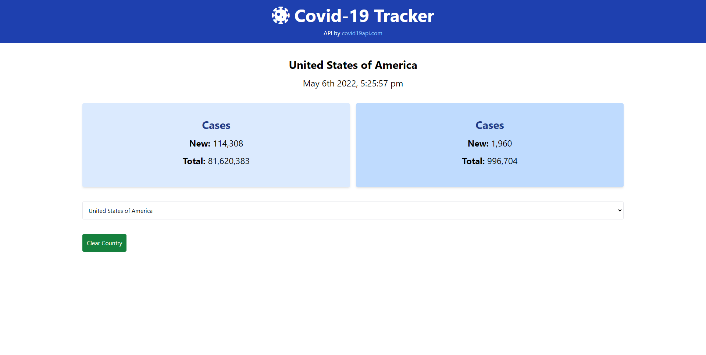

  # Covid Tracker
  

  ## Description
  An app that allows users to view Covid-19 cases and fatalities globally and by choosing a specific country.  

  
  
  ## Table of Contents
  * [Installation](#installation)
  * [Usage](#usage)
  * [License](#license)
  * [Contributing](#contributing)
  * [Tests](#tests)
  * [Questions](#questions)

  
  ## Installation
  Install Node [Here!](https://nodejs.org/en/)
   
  Install Vue/Vue Cli - Access Vue's official installation docs [Here!](https://vuejs.org/guide/quick-start.html#with-build-tools)
   
  `Moment` npm package for dates and `Tailwind CSS` for styling were also used

  ## Usage 
  Click on the `Select Country` drop down to view different countries that may have Covid-19 cases and fatalities.  A `Clear Country` button will also appear if a country is selected, allowing the user to show global results again.
  
  ## License 
  Covid-Tracker is distributed under the [MIT](https://opensource.org/licenses/MIT) License
    
  
  ## Contributing
   Contributors: Malik Spruill  
   API by covid19api.com

  ## Tests 
  Include these tools to properly run tests within the application:
  N/A 
  
  
  ## Questions
  Have questions about the repo/application? Contact me:
  <a href="https://github.com/Malik Spruill" target="_blank">https://github.com/Malik Spruill</a> 
  Email: malikspruill@gmail.com
   